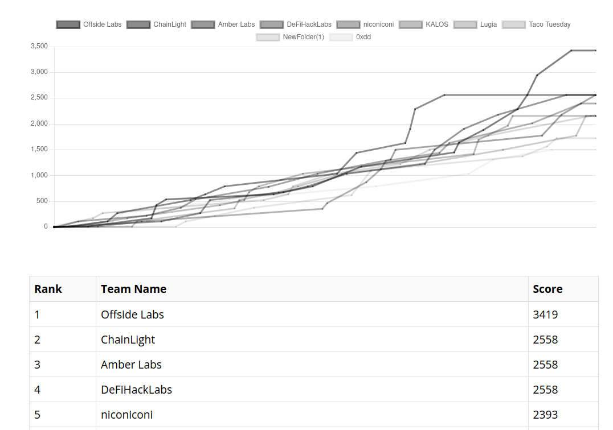

## Introduction

Challenges can be found here : https://github.com/fuzzland/blazctf-2023/tree/main/challenges

## Challenges I solved : 

- Jambo (EVM, REVERSE) (33 solves)
- Maze (YUL) (24 solves)
- Ghost (EVM, PWN) (13 solves)

## DeFiHackLabs 

I was lucky enough to play this ctf with the `DeFiHackLabs` team (Rank 4).

Although some of my teammate solved theses challenges faster than me, and I faced difficulties with the [Missing challenge](https://github.com/fuzzland/blazctf-2023/tree/main/solutions/missing), I decided to continue working on them to maintain my mental well-being :)



## JAMBO

**EVM,PWN / 33 solves / 155 pts**

**Author: publicqi (@publicqi)**

### Challenge Background
```
Tony went crazy. No one knows what he has deployed on Ethereum. 
```
 The player's challenge is to bring the balance of this enigmatic contract to zero. The only clue available is the contract's bytecode, necessitating a reverse engineering approach.

```solidity
// SPDX-License-Identifier: UNLICENSED
pragma solidity ^0.8.21;

interface Jambo {
    function answer(bytes memory _answer) external payable;
    function start(uint256 qid, bytes32 _answer) external payable;
    function revokeOwnership() external;
}

contract Challenge {
    address public immutable target;

    constructor() payable {
        bytes memory bytecode = hex"60806040526200000e62000157565b6200001862000027565b610a24620001ad8239610a2481f35b5f604051905090565b5f73ffffffffffffffffffffffffffffffffffffffff82169050919050565b5f6200005b8262000030565b9050919050565b5f8160601b9050919050565b5f6200007a8262000062565b9050919050565b5f6200008d826200006e565b9050919050565b620000a9620000a3826200004f565b62000081565b82525050565b5f620000bc828462000094565b60148201915081905092915050565b5f601f19601f8301169050919050565b7f4e487b71000000000000000000000000000000000000000000000000000000005f52604160045260245ffd5b6200011382620000cb565b810181811067ffffffffffffffff82111715620001355762000134620000db565b5b80604052505050565b5f819050602082019050919050565b5f81519050919050565b336200016262000027565b60208101620001728382620000af565b6020830181038352620001888382038462000108565b62000193836200014d565b6200019e846200013e565b20806001815550505050505056fe60806040526004361061007b576100165f35610088565b80632b968958811461004857632f48494781146100555763b06a5c5281146100625763f5b938e2811461006f57610078565b6100506100c7565b610078565b61005d610287565b610078565b61006a61033e565b610078565b610077610413565b5b50505b61008361043f565b6109ed565b5f8160e01c9050919050565b5f604051905090565b5f80fd5b5f80fd5b5f81830312156100b8576100b76100a1565b5b5050565b5f8082019050919050565b34156100d6576100d561009d565b5b6100e13660046100a5565b6100e961052e565b6100f1610094565b6100fa816100bc565b81810382f35b5f80fd5b5f80fd5b5f80fd5b5f601f19601f8301169050919050565b7f4e487b71000000000000000000000000000000000000000000000000000000005f52604160045260245ffd5b6101528261010c565b810181811067ffffffffffffffff821117156101715761017061011c565b5b80604052505050565b5f610183610094565b905061018f8282610149565b919050565b5f67ffffffffffffffff8211156101ae576101ad61011c565b5b6101b78261010c565b9050602081019050919050565b828183375f83830152505050565b5f6101e46101df84610194565b61017a565b905082815260208101848484011115610200576101ff610108565b5b61020b8482856101c4565b509392505050565b5f82601f83011261022757610226610104565b5b81356102378482602086016101d2565b91505092915050565b5f60208284031215610255576102546100a1565b5b5f82013567ffffffffffffffff81111561027257610271610100565b5b61027e84828501610213565b91505092915050565b610292366004610240565b61029b816106c7565b6102a3610094565b6102ac816100bc565b81810382f35b5f82821c905092915050565b5f819050919050565b5f6102dd6102d883600886026102b2565b6102be565b905092915050565b5f6102f18383546102c7565b905092915050565b5f805f61030681836102e5565b9250505090565b5f819050919050565b61031f8161030d565b82525050565b5f6020820190506103385f830184610316565b92915050565b341561034d5761034c61009d565b5b6103583660046100a5565b6103606102f9565b610368610094565b6103728282610325565b81810382f35b6103818161030d565b811461038b575f80fd5b50565b5f8135905061039c81610378565b92915050565b5f819050919050565b6103b4816103a2565b81146103be575f80fd5b50565b5f813590506103cf816103ab565b92915050565b5f80604083850312156103eb576103ea6100a1565b5b5f6103f88582860161038e565b9250506020610409858286016103c1565b9150509250929050565b61041e3660046103d5565b61042881836109df565b610430610094565b610439816100bc565b81810382f35b5f80fd5b5f73ffffffffffffffffffffffffffffffffffffffff82169050919050565b5f61046c82610443565b9050919050565b5f8160601b9050919050565b5f61048982610473565b9050919050565b5f61049a8261047f565b9050919050565b6104b26104ad82610462565b610490565b82525050565b5f6104c382846104a1565b60148201915081905092915050565b5f819050602082019050919050565b5f81519050919050565b5f90565b5f819050919050565b5f819050919050565b5f61051b610516610511846104ef565b6104f8565b61030d565b9050919050565b8061052b575f80fd5b50565b33610537610094565b6020810161054583826104b8565b602083018103835261055983820384610149565b610562836104e1565b61056b846104d2565b20805f6105766104eb565b809150825491508180600161058a81610501565b6105938361030d565b1461059d81610522565b5f8755505050505050505050505050565b5f815f1c9050919050565b5f819050919050565b5f6105d46105cf836105ae565b6105b9565b9050919050565b5f6105e682546105c2565b9050919050565b5f819050919050565b5f61061061060b610606846105ed565b6104f8565b61030d565b9050919050565b5f61063161062c61062784610443565b6104f8565b610443565b9050919050565b5f61064282610617565b9050919050565b5f61065382610638565b9050919050565b5f61066482610617565b9050919050565b5f6106758261065a565b9050919050565b5f6106868261065a565b9050919050565b610695610094565b3d5f823e3d81fd5b5f819050919050565b5f6106c06106bb6106b68461069d565b6104f8565b61030d565b9050919050565b6106d160016105db565b8082806106dd816104e1565b6106e6826104d2565b206106f0816103a2565b6106f9856103a2565b148080156107255734670de0b6b3a7640000610714816105f6565b61071d8361030d565b118093505050505b80156107aa573361073581610649565b61073e8161066b565b306107488161067c565b80315f81610756576108fc90505b5f805f80858986f18061076c5761076b61068d565b5b5f6107756104eb565b809150333b915081805f610788816106a6565b6107918361030d565b1461079b81610522565b50505050505050505050505050505b5050505050505050565b6107bc610094565b3381526020812060378160f81c036107d65761ffff811656005b50506107e282826108fe565b5050565b5f815f1b9050919050565b5f7fffffffffffffffffffffffffffffffffffffffffffffffffffffffffffffffff61081c846107e6565b9350801983169250808416831791505092915050565b5f61084c6108476108428461030d565b6104f8565b61030d565b9050919050565b5f819050919050565b61086582610832565b61087861087182610853565b83546107f1565b8255505050565b5f819050919050565b610899610894826103a2565b61087f565b82525050565b5f6108aa8284610888565b60208201915081905092915050565b5f6108c3826103a2565b9050919050565b5f6108d4826105ae565b9050919050565b6108e4826108b9565b6108f76108f0826108ca565b83546107f1565b8255505050565b808061090a815f61085c565b808480610915610094565b60208101610923838261089f565b602083018103835261093783820384610149565b610940836104e1565b610949846104d2565b206109558160016108db565b803361095f610094565b6020810161096d83826104b8565b602083018103835261098183820384610149565b61098a836104e1565b610993846104d2565b20805f61099e6104eb565b80915082549150818060016109b281610501565b6109bb8361030d565b146109c581610522565b505050505050505050505050505050505050505050505050565b6109e982826107b4565b5050565bfea2646970667358225b5f5f5f5f3361fffff400fa76a6d904926b7e33347e66ac48cec08478ce15f7e22464736f6c63430008160033";
        uint256 value = address(this).balance;
        address addr;

        assembly {
            addr := create(value, add(bytecode, 0x20), mload(bytecode))
            if iszero(addr) { revert(0, 0) }
        }
        target = addr;

        Jambo(target).start(0x1337, bytes32(0x66757a7a7a7a7a7a7a7a7a7a7a7a7a7a7a7a7a7a7a7a7a7a7a7a7a7a6c616e64));
        Jambo(target).revokeOwnership();
    }

    function isSolved() public view returns (bool) {
        return address(target).balance == 0;
    }
}
```
#### Challenge Contract Mechanics
Participants interact with a contract named `Challenge`. This contract, upon deployment, performs the following actions:
- Deploys a new contract using a predefined bytecode and assigns its address to a variable called `target`.
- Utilizes the `Jambo` interface to invoke two specific functions on the target contract:
  1. `start` function with preset parameters, initializing certain operations.
  2. `revokeOwnership` function, altering the ownership state of the target.

```solidity
Jambo(target).start(0x1337, bytes32(0x66757a7a7a7a7a7a7a7a7a7a7a7a7a7a7a7a7a7a7a7a7a7a7a7a7a7a6c616e64));

Jambo(target).revokeOwnership();
```

### Approach to Solving
1. **Decompilation of Target Contract:**
   - Utilize tools like [Dehaub](https://library.dedaub.com/decompile) or [Panoramix](https://github.com/eveem-org/panoramix) for reverse engineering the target's bytecode.
   - Be cautious, as decompilers can often produce inaccuracies, especially in CTF contexts.
   - The following link provides the code as decompiled by Dehaub: 

```bash
// Decompiled by library.dedaub.com
// 2023.12.02 05:59 UTC
// Compiled using the solidity compiler version 0.8.22

// Data structures and variables inferred from the use of storage instructions
uint256 _questionId; // STORAGE[0x0] 0x1337
uint256 stor_1; // STORAGE[0x1] keccak256(0x66757a7a7a7a7a7a7a7a7a7a7a7a7a7a7a7a7a7a7a7a7a7a7a7a7a7a6c616e64)


function 0x149(bytes varg0, uint256 varg1) private { // SET FMP
    v0 = varg0 + (varg1 + 31 & ~0x1f);
    require(!((v0 > uint64.max) | (v0 < varg0)), Panic(65)); // failed memory allocation (too much memory)
    MEM[64] = v0;
    return ;
}

function revokeOwnership() public nonPayable { 
    0xa5(4, msg.data.length);
    0x149(MEM[64], 52);
    v0 = 0x501(1);
    require(STORAGE[keccak256(msg.sender)] == v0);
    STORAGE[keccak256(msg.sender)] = 0;
    return ;
}

function 0x501(uint256 varg0) private { 
    return varg0;
}

function 0x2f484947(bytes varg0) public payable { 
    //require(msg.data.length - 4 >= 32);
    require(varg0 <= uint64.max);
    require(4 + varg0 + 31 < msg.data.length);
    //require(varg0.length <= uint64.max, Panic(65)); // failed memory allocation (too much memory)
    v0 = new bytes[](varg0.length);
    0x149(v0, (varg0.length + 31 & ~0x1f) + 32); //@audit set fmp 
    //require(varg0.data + varg0.length <= msg.data.length); // ????
    CALLDATACOPY(v0.data, varg0.data, varg0.length); //@audit-info put varg0 in memory 
    //v0[varg0.length] = 0; //out of length, more like delimiting the array 
    v1 = v0.length;
    v2 = v0.data;
    v3 = v4 = stor_1 == keccak256(v0); // == spelhash 
    if (v4) {
        v3 = msg.value > 10 ** 18; //need > 1 ether 
    }
    if (v3) {
        v5 = v6 = msg.sender;
        v7 = this;
        v8 = v9 = 0;
        if (!v7.balance) { // Decompilatin error
            v8 = 2300;
        }
        v11 = v6.call().value(v7.balance).gas(v8); //@audit here
        require(v11, MEM[64], RETURNDATASIZE()); //require success
        require(msg.sender.code.size == 0); // require msg.sender == not SC
    }
    return ;
}

function 0x617(address varg0) private { 
    return varg0;
}

function questionId() public nonPayable { 
    0xa5(4, msg.data.length);
    return _questionId;
}

function start(uint256 tokenId, bytes32 spellHash) public payable { 
    require(msg.data.length - 4 >= 64);
    //require(tokenId == tokenId);
    //require(spellHash == spellHash);
    if ((keccak256(msg.sender) >> 248) - 55) {
        _questionId = tokenId;
        0x149(MEM[64], 64);
        stor_1 = uint256(keccak256(spellHash));
        0x149(MEM[64], 52);
        v0 = 0x501(1);
        require(STORAGE[keccak256(msg.sender)] == v0); // require mapping(msg.sender) ==> TRUE, check if owner or deployer tmtc
    }
    return ;
}

function function_selector() public payable { 
    revert();
}

function 0xa5(uint256 varg0, uint256 varg1) private { 
    require(varg1 - varg0 >= 0);
    return ;
}

// Note: The function selector is not present in the original solidity code.
// However, we display it for the sake of completeness.

function function_selector( function_selector) public payable { 
    MEM[64] = 128;
    if (msg.data.length >= 4) {
        if (function_selector >> 224 == 0x2b968958) {
            revokeOwnership();
        } else if (function_selector >> 224 == 0x2f484947) {
            0x2f484947();
        } else if (function_selector >> 224 == 0xb06a5c52) {
            questionId();
        } else if (function_selector >> 224 == 0xf5b938e2) {
            start(uint256,bytes32);
        }
    }
    ();
}
```

2. **Analysis of Key Functions:**
   - **`revokeOwnership`**: This function revokes ownership by setting the owner variable to a null address. This function is not crucial for solving the challenge.
   ```solidity
   function revokeOwnership() public nonPayable {

      // Check if msg.data.length == 4
      0xa5(4, msg.data.length);

      // Set the memory pointer
      0x149(MEM[64], 52);

      // Set v0 to 1 
      v0 = 0x501(1);

      // Check if msg.sender is the Owner
      require(STORAGE[keccak256(msg.sender)] == v0);

      // Set the Ownership to false
      STORAGE[keccak256(msg.sender)] = 0;
      return ;
   }
   ```
   - **`start`**: Sets two critical variables based on the input parameters. The function prepares the ground for the challenge-solving strategy.
   ```solidity
   function start(uint256 tokenId, bytes32 spellHash) public payable { 

      // Check if msg.data.length is 1 selector (4 bytes) and 2 variables (2*32 bytes)
      require(msg.data.length - 4 >= 64);

      // ?? Decompilation error imo
      if ((keccak256(msg.sender) >> 248) - 55) {

         // Store tokenId in _questionId
         _questionId = tokenId;

         // Set fmp
         0x149(MEM[64], 64);

         // Store keccak256(spellHash) in stor_1
         stor_1 = uint256(keccak256(spellHash));

         // Set fmp
         0x149(MEM[64], 52);

         // CHeck if msg.sender is the owner
         v0 = 0x501(1);
         require(STORAGE[keccak256(msg.sender)] == v0); // require mapping(msg.sender) ==> TRUE
      
      }
      return ;
   }
   ```

3. **The Crux of the Challenge - `answer` Function:**
   - The solution hinges on the `answer` function, which is inferred from the challenge's interface.
   - The function requires an input that matches the `spellHash` set in the `start` function and an Ethereum transaction with a value greater than 1 ether.
   - When these conditions are met, the function transfers the entire balance of the target contract to the sender.
   ```solidity
   function 0x2f484947(bytes varg0) public payable { 
      //require(msg.data.length - 4 >= 32);
      require(varg0 <= uint64.max);
      require(4 + varg0 + 31 < msg.data.length);
      //require(varg0.length <= uint64.max, Panic(65)); // failed memory allocation (too much memory)
      v0 = new bytes[](varg0.length);
      0x149(v0, (varg0.length + 31 & ~0x1f) + 32); // set fmp 
      //require(varg0.data + varg0.length <= msg.data.length);
      CALLDATACOPY(v0.data, varg0.data, varg0.length); // put varg0 in memory 
      //v0[varg0.length] = 0; //out of length, more like delimiting the array 
      v1 = v0.length;
      v2 = v0.data;
      v3 = v4 = stor_1 == keccak256(v0); // == spelhash 
      if (v4) {
         v3 = msg.value > 10 ** 18; //need > 1 ether 
      }
      if (v3) {
         v5 = v6 = msg.sender;
         v7 = this;
         v8 = v9 = 0;
         if (!v7.balance) { // Decompilation error
               v8 = 2300;
         }
         v11 = v6.call().value(v7.balance).gas(v8); // here
         require(v11, MEM[64], RETURNDATASIZE()); //require success
         require(msg.sender.code.size == 0); // require msg.sender == not SC
      }
      return ;
   }
   ```
   
   **The function primarily consists of four key sections**
   ```solidity
   v0 = new bytes[](varg0.length);
      0x149(v0, (varg0.length + 31 & ~0x1f) + 32); // set fmp 
      //require(varg0.data + varg0.length <= msg.data.length);
      CALLDATACOPY(v0.data, varg0.data, varg0.length); // put varg0 in memory 
   ```
   Store in `v0` `varg0`, with `varg0` the input of the function

   ```solidity
   v3 = v4 = stor_1 == keccak256(v0); // == spelhash 
   ```
   Check if `v0 == stor_1`, with `stor_1` previously set in the `start(uin256,bytes32)` function

   ```solidity
   if (v4) {
         v3 = msg.value > 10 ** 18; //need > 1 ether 
      }
   ```
   Check if `msg.value > 1 ether`

   ```solidity
   v5 = v6 = msg.sender;
   v7 = this;
   ...
   v11 = v6.call().value(v7.balance).gas(v8); // here
   ```
   Send all the `contract balance` to `msg.sender`
   

### Solution Script
- A foundry script is provided for executing the solution. It involves:
  - Setting up a connection with the `Jambo` interface.
  - Preparing the correct input data that aligns with the `spellHash`.
  - Sending a transaction with the required ether value to trigger the `answer` function and drain the target contract's balance.

   ```solidity
   bytes memory data = hex"66757a7a7a7a7a7a7a7a7a7a7a7a7a7a7a7a7a7a7a7a7a7a7a7a7a7a6c616e64";
   
   Jambo(address(chall.target())).answer{value : 1.1 ether}(data);
   ```

   Link to the solution script:


```solidity
// SPDX-License-Identifier: UNLICENSED
pragma solidity ^0.8.13;

import "forge-std/Script.sol";
import "forge-std/console.sol";

import "../src/Challenge.sol";

contract ExploitScript is Script {
    Challenge chall = Challenge(0xd120465D26e07971249e84acc33178747Bb6437B);
    function setUp() public {}

    function run() public {
        vm.startBroadcast();
        bytes memory data = hex"66757a7a7a7a7a7a7a7a7a7a7a7a7a7a7a7a7a7a7a7a7a7a7a7a7a7a6c616e64";
        Jambo(address(chall.target())).answer{value : 1.1 ether}(data);
        
        vm.stopBroadcast();
    }
}
```


<p align="center">
Feel free to pose your questions here: https://twitter.com/0x_m4k2
</p>