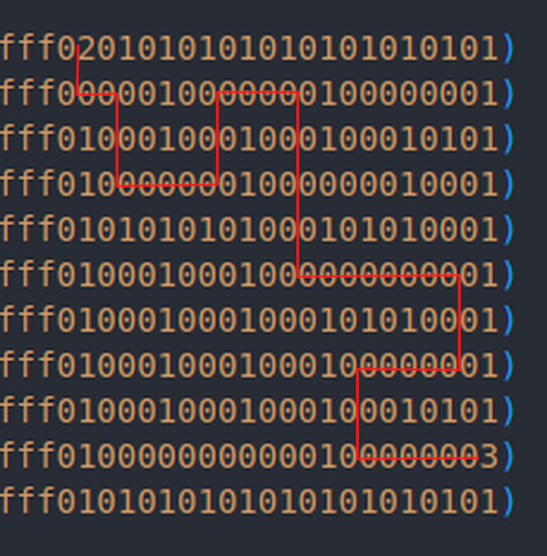

## Introduction

Challenges can be found here : https://github.com/fuzzland/blazctf-2023/tree/main/challenges

## Challenges I solved : 

- Jambo (EVM, REVERSE) (33 solves)
- Maze (YUL) (24 solves)
- Ghost (EVM, PWN) (13 solves)

## DeFiHackLabs 

I was lucky enough to play this ctf with the `DeFiHackLabs` team (Rank 4).

Although some of my teammate solved theses challenges faster than me, and I faced difficulties with the [Missing challenge](https://github.com/fuzzland/blazctf-2023/tree/main/solutions/missing), I decided to continue working on them to maintain my mental well-being :)


## MAZE 
**YUL / 24 solves / 190 pts**
 
**Author: publicqi (@publicqi)**

### Background of the Challenge
```
Tony made billions $ from rug pulling. He bought an island in Fiji, started to study philosophy, and devoted to learning labyrinth.
```
In this challenge, players aim to navigate out of a maze by manipulating a player's position on a 2D grid, adjusting the x and y coordinates.


```solidity
// SPDX-License-Identifier: MIT
pragma solidity ^0.8.0;

contract Challenge {
    address public target;

    constructor() {
        // Using bytecode to deploy is just a way to workaround yul deployment in foundry
        // Source: Maze.yul
        bytes memory bytecode =
            hex"6afdfefefefefefefefefefe195f9081556afffffefffffffefffffffe196001556afefffefffefffefffefefe1960028181556afefffffffefffffffefffe196003556afefefefefefffefefefffe196004556afefffefffefffffffffffe196005556afefffefffefffefefefffe196006556afefffefffefffefffffffe196007556008919091556afefffffffffffefffffffc196009556afefefefefefefefefefefe19600a55600b829055600c829055600d829055600e556101b69081906100c990395ff3fe602036146101ac57338073f9a2c330a19e2fbfeb50fe7a7195b973bb0a3be91461018e5780732acf0d6fdac920081a446868b2f09a8dac7974481461019d578073872917cec8992487651ee633dba73bd3a9dca3091461018e5773802271c02f76701929e1ea772e72783d28e4b60f1461018057600e54801519610117575b505b600360ff600b54600c54600a82116100fe575b600a81116100e6575b5490600a03831b1c1660ff811460018214176100c2575b146100ba57005b6001600d5500005b4556454e204d4152494f2043414e4e4f542048495420544849532057414c4c6100b3565b5448495320495320412046414b4520464c414761009c565b4e4f204553434150452046524f4d204d415a4521610093565b5f19908101600e5536600114610173575b60023614610166575b5060033614610158575b6004361461014a575b5f61007e565b6001600b5401600b55610144565b6001600c5401600c5561013b565b600b5401600b555f610131565b80600c5401600c55610128565b6001600b5401600b55610080565b506001600c5401600c55610080565b505f19600b5401600b55610080565b600d545f5260205ff3";

        address addr;
        assembly {
            addr := create(0, add(bytecode, 0x20), mload(bytecode))
            if iszero(addr) { revert(0, 0) }
        }

        target = addr;
    }

    function isSolved() external returns (bool) {
        (, bytes memory ret) = target.call("00000000000000000000000000000000");
        bool solved;

        assembly {
            solved := mload(add(ret, 0x20))
        }

        return solved;
    }
}
```

### The Maze Explained

The maze, crafted in Yul, can be explored here: 

```bash
// solc --strict-assembly Maze.yul --bin --optimize
object "Maze" {
    // Four types of sprites:
    // 0x00 => Empty
    // 0x01 => Wall
    // 0x02 => Player
    // 0x03 => Exit
    // 0xff => Invalid
    code {
        sstore(0x0, 0xffffffffffffffffffffffffffffffffffffffffff0201010101010101010101)
        sstore(0x1, 0xffffffffffffffffffffffffffffffffffffffffff0000010000000100000001)  
        sstore(0x2, 0xffffffffffffffffffffffffffffffffffffffffff0100010001000100010101)  
        sstore(0x3, 0xffffffffffffffffffffffffffffffffffffffffff0100000001000000010001)            
        sstore(0x4, 0xffffffffffffffffffffffffffffffffffffffffff0101010101000101010001)          
        sstore(0x5, 0xffffffffffffffffffffffffffffffffffffffffff0100010001000000000001)     
        sstore(0x6, 0xffffffffffffffffffffffffffffffffffffffffff0100010001000101010001)
        sstore(0x7, 0xffffffffffffffffffffffffffffffffffffffffff0100010001000100000001)
        sstore(0x8, 0xffffffffffffffffffffffffffffffffffffffffff0100010001000100010101)
        sstore(0x9, 0xffffffffffffffffffffffffffffffffffffffffff0100000000000100000003)
        sstore(0xa, 0xffffffffffffffffffffffffffffffffffffffffff0101010101010101010101)

        sstore(0xb, 0x0)
        sstore(0xc, 0x0)
        sstore(0xd, 0x0)
        sstore(0xe, 0x2)

        codecopy(0, dataoffset("Maze_Runtime"), datasize("Maze_Runtime"))
        return (0, datasize("Maze_Runtime"))
    }

    object "Maze_Runtime" {
        code {
            // return isSolved
            if eq(calldatasize(), 0x20) {
                mstore(0x0, sload(0xd))
                return (0, 0x20)
            }

            // Game starts here
            let msg_sdr := caller()

            switch msg_sdr 
            // 0x46
            case 0xF9A2C330a19e2FbFeB50fe7a7195b973bB0A3BE9 { // -y
                verbatim_0i_0o(hex"6001600c5403600c55")
            }
            // 0x75
            case 0x2ACf0D6fdaC920081A446868B2f09A8dAc797448 { // -x
                sstore(0xb, sub(sload(0xb), 1))
            }
            // 0x7a
            case 0x872917cEC8992487651Ee633DBA73bd3A9dcA309 { // +y
                verbatim_0i_0o(hex"6001600c5401600c55")
            }
            // 0x5a
            case 0x802271c02F76701929E1ea772e72783D28e4b60f { // +x
                sstore(0xb, add(sload(0xb), 1))
            }

            // can do it by using the calldata length too
            default {
                if not(iszero(sload(0xe))) {
                    sstore(0xe, sub(sload(0xe), 1))
                    let calldatalen := calldatasize()
                    if eq(calldatalen, 0x1) { 
                        sstore(0xc, sub(sload(0xc), 1)) // - y
                    }
                    if eq(calldatalen, 0x2) {
                        sstore(0xb, sub(sload(0xb), 1)) // - x
                    }
                    if eq(calldatalen, 0x3) {
                        sstore(0xc, add(sload(0xc), 1)) // + y 
                    }
                    if eq(calldatalen, 0x4) {
                        sstore(0xb, add(sload(0xb), 1)) // + x
                    }
                }
            }

            let pos_x := sload(0xb)
            let pos_y := sload(0xc)

            // check if player still in the maze
                            if gt(pos_x, 10) {
                                verbatim_0i_0o(hex"4e4f204553434150452046524f4d204d415a4521")
                            }

                            if gt(pos_y, 10) {
                                verbatim_0i_0o(hex"5448495320495320412046414b4520464c4147")
                            }


            let pos := getPos(pos_x, pos_y)


            // if player outside or on wall ==> dead
                            if or(eq(pos, 0x1), eq(pos, 0xff)) {
                                verbatim_0i_0o(hex"4556454e204d4152494f2043414e4e4f542048495420544849532057414c4c")
                            }

            if eq(pos, 0x3) {
                verbatim_0i_0o(hex"6001600d5500")
            }

            // Function restructured to logically align x and y
            function getPos(x, y) -> type_ {
                type_ := and(shr(mul(8, sub(10, x)), sload(y)), 0xff)
            }

            // Original source function
            /* function getPos(y, x) -> type_ {
                type_ := and(shr(mul(8, sub(10, y)), sload(x)), 0xff)
            } */
        }
    }
}
```

Let's break down the key parts of the challenge:

#### Maze Initialization and Layout
- The contract sets up the maze using Ethereum's storage (`sstore`). Each cell in the grid is denoted by a byte, representing various elements like empty space, walls, the player, the exit, and invalid areas.
- The maze is laid out across several storage slots (`0x0` to `0xa`), where each slot contains a row of the maze.
- Additional slots (`0xb` to `0xe`) track the player's coordinates and other game aspects.

```solidity
  // Sprite Types:
    // 0x00 => Empty
    // 0x01 => Wall
    // 0x02 => Player
    // 0x03 => Exit
    // 0xff => Invalid
    code {
        // [Maze initialization code is omitted for brevity]
    }
  ```

#### Maze_Runtime: The Game Logic
This section of the code governs the game's operation when the contract is called.

1. **Game Completion Check:**
   - If `calldatasize()` equals `0x20`, the contract reveals whether the game has been solved by returning the value in slot `0xd`.
    ```solidity
        // return isSolved
        if eq(calldatasize(), 0x20) {
            mstore(0x0, sload(0xd))
            return (0, 0x20)
        }
    ```

2. **Player Movement Mechanics:**
   - The player's movement is determined by the `caller` address or the size of the call data (`calldatasize()`).
   - Specific Ethereum addresses correspond to movement directions (e.g., `-x`, `+y`).
   - Private keys for these addresses are accessible on [privatekeyfinder.io](https://privatekeyfinder.io/private-keys/ethereum/2).
   - The `switch` statement updates the player's position based on these inputs.
   - The [verbatim](https://docs.soliditylang.org/en/latest/yul.html#verbatim) instruction def : The set of verbatim... builtin functions lets you create bytecode for opcodes that are not known to the Yul compiler. It also allows you to create bytecode sequences that will not be modified by the optimizer.
   
    ```solidity
        // Game starts here
        let msg_sdr := caller()
        switch msg_sdr 
        // 0x46
        case 0xF9A2C330a19e2FbFeB50fe7a7195b973bB0A3BE9 { // -y
            verbatim_0i_0o(hex"6001600c5403600c55")
        }
        // 0x75
        case 0x2ACf0D6fdaC920081A446868B2f09A8dAc797448 { // -x
            sstore(0xb, sub(sload(0xb), 1))
        }
        // 0x7a
        case 0x872917cEC8992487651Ee633DBA73bd3A9dcA309 { // +y
            verbatim_0i_0o(hex"6001600c5401600c55")
        }
        // 0x5a
        case 0x802271c02F76701929E1ea772e72783D28e4b60f { // +x
            sstore(0xb, add(sload(0xb), 1))
        }
        // can do it by using the calldata length too
        default {
            if not(iszero(sload(0xe))) {
                sstore(0xe, sub(sload(0xe), 1))
                let calldatalen := calldatasize()
                if eq(calldatalen, 0x1) { 
                    sstore(0xc, sub(sload(0xc), 1)) // - y
                }
                if eq(calldatalen, 0x2) {
                    sstore(0xb, sub(sload(0xb), 1)) // - x
                }
                if eq(calldatalen, 0x3) {
                    sstore(0xc, add(sload(0xc), 1)) // + y 
                }
                if eq(calldatalen, 0x4) {
                    sstore(0xb, add(sload(0xb), 1)) // + x
                }
            }
        }
    ```

3. **Position Determination:**
  
    The `getPos` function in the Yul code calculates the sprite type at a given (x, y) coordinate in the maze. It works as follows:

   1. **Adjusts the x-coordinate** by calculating `10 - x` and multiplies the result by 8. This step finds the bit position of the sprite in the storage slot, considering each sprite occupies 8 bits (1 byte).

   2. **Retrieves the y-coordinate storage slot** using `sload(y)`, which loads the data stored at the y-coordinate.

   3. **Shifts the bits** to the right by the calculated bit position using `shr`. This isolates the 8-bit sprite data for the given x-coordinate.

   4. **Extracts the sprite type** using a bitwise AND with `0xff` to keep only the last 8 bits. This represents the sprite type (e.g., empty, wall, player) at the (x, y) location.

   ```solidity
        // Function restructured to logically align x and y
        function getPos(x, y) -> type_ {
            type_ := and(shr(mul(8, sub(10, x)), sload(y)), 0xff)
        }
   ```

4. **Gameplay Dynamics:**
   - The contract ensures the player remains within the maze's confines.
   - Hitting a wall or an invalid space results in a game over.
   - Reaching the exit (sprite type `0x3`) signifies the game is solved.
   ```solidity
        let pos_x := sload(0xb)
        let pos_y := sload(0xc)

        // check if player still in the maze
            if gt(pos_x, 10) {
                verbatim_0i_0o(hex"4e4f204553434150452046524f4d204d415a4521")
            }

            if gt(pos_y, 10) {
                verbatim_0i_0o(hex"5448495320495320412046414b4520464c4147")
            }

            let pos := getPos(pos_x, pos_y)

        // if player outside or on wall ==> dead
            if or(eq(pos, 0x1), eq(pos, 0xff)) {
                verbatim_0i_0o(hex"4556454e204d4152494f2043414e4e4f542048495420544849532057414c4c")
            }

        if eq(pos, 0x3) {
            verbatim_0i_0o(hex"6001600d5500")
        }
   ```

### Solving the Challenge

The initial step involves mapping a path through the maze. The chosen path for this write-up involves a series of movements altering `x` and `y` coordinates. Here's an illustration:



Given the starting position at [0,0], the y-axis is inverted, and the x-axis behaves typically. The path :
```
- +y
- +x
- +y * 2
- +x * 2
- -y * 2
- +x * 2
- +y * 4
- +x * 4 
- +y * 2
- -x * 2
- +x * 3
```


Example transaction to trigger `+y` movement:
```solidity
// Setting PrivateKey and PublicKey 
uint256 py = uint8(bytes1(0x7a));
address PY_addr = vm.addr(py);

// Label the addr to debug efficiently in the foundry stacktrace
vm.label(PY_addr, "PY");

// Signe the next transaction with the PrivateKey given
vm.broadcast(py);
maze.call("");
```

Upon executing the script repeatedly to create a series of transactions, the script unexpectedly fails.

During the debugging process, it becomes apparent that the actions for `- y` and `+ y` have identical results. This anomaly is linked to a known issue described in [Solidity's documentation](https://soliditylang.org/blog/2023/11/08/verbatim-invalid-deduplication-bug/), where the optimizer mistakenly perceives both blocks of code as identical and merges them.

Initially, during the CTF, I wasn't aware of this optimizer issue and instead explored an alternative approach for adjusting the player's position using the default case in the `switch` statement. 

This is why this particular path was selected because the default mode can be accessed only twice, as it decrements the value in storage slot `0xe` (initialized with `0x02`) each time it's entered.

```solidity
// Player movement can also be controlled using calldata length
default {
    if not(iszero(sload(0xe))) {
        sstore(0xe, sub(sload(0xe), 1))
        let calldatalen := calldatasize()
        if eq(calldatalen, 0x1) {
            sstore(0xc, sub(sload(0xc), 1)) // - y
        }
        if eq(calldatalen, 0x2) {
            sstore(0xb, sub(sload(0xb), 1)) // - x
        }
        if eq(calldatalen, 0x3) {
            sstore(0xc, add(sload(0xc), 1)) // + y
        }
        if eq(calldatalen, 0x4) {
            sstore(0xb, add(sload(0xb), 1)) // + x
        }
    }
}
```

For the specific instances where the `y` value needs to be decreased, transactions are signed using the player's private key and include a single byte of calldata, as demonstrated below:

```solidity
vm.broadcast(player);
maze.call(hex"ff");
vm.broadcast(player);
maze.call(hex"ff");
```

### Solution Script and Acknowledgments

Access the solution script here: 

```solidity
// SPDX-License-Identifier: UNLICENSED
pragma solidity ^0.8.13;

import "forge-std/Script.sol";
import "forge-std/console.sol";

import "../src/Challenge.sol";

contract ExploitScript is Script {

    Challenge chall;
    address  maze;

    uint256 my = uint8(bytes1(0x46));
    uint256 py = uint8(bytes1(0x7a));
    uint256 mx = uint8(bytes1(0x75));
    uint256 px = uint8(bytes1(0x5a));

    uint256 player = uint256(bytes32(0xf811da4ab3a0626af81f01b7c342baefd284a3690b1f6a035348ec78ffd7c58e));

    address MY_addr = vm.addr(my);
    address PY_addr = vm.addr(py);
    address MX_addr = vm.addr(mx);
    address PX_addr = vm.addr(px);

    function setUp() public {
        /* console.log(MY_addr);
        console.log(MX_addr);
        console.log(PY_addr);
        console.log(PX_addr); */

        vm.startBroadcast(player);
        MY_addr.call{value : 1 ether}("");
        PY_addr.call{value : 1 ether}("");
        MX_addr.call{value : 1 ether}("");
        PX_addr.call{value : 1 ether}("");
        assert(MY_addr.balance > 0);
        assert(PY_addr.balance > 0);
        assert(MX_addr.balance > 0);
        assert(PX_addr.balance > 0);
        vm.stopBroadcast();

        vm.label(MY_addr, "MY");
        vm.label(PY_addr, "PY");
        vm.label(MX_addr, "MX");
        vm.label(PX_addr, "PX");

        //vm.label(player, "PLAYER");

        chall = Challenge(0x23aaAe256BA3d548D8C0E1E53f0F7d8b1bb60742);


        
    }

    function run() public {
        maze = chall.target();
        vm.label(maze, "MAZE");

        print();
        
        vm.broadcast(py);
        maze.call("");
        print();
        
        vm.broadcast(px);
        maze.call("");
        print();


        vm.broadcast(py);
        maze.call("");
        print();
        vm.broadcast(py);
        maze.call("");
        print();

        vm.broadcast(px);
        maze.call("");
        print();
        vm.broadcast(px);
        maze.call("");
        print();

        vm.broadcast(player);
        maze.call(hex"ff");
        print();
        vm.broadcast(player);
        maze.call(hex"ff");
        print();

        vm.broadcast(px);
        maze.call("");
        print();
        vm.broadcast(px);
        maze.call("");
        print();

        vm.broadcast(py);
        maze.call("");
        vm.broadcast(py);
        maze.call("");
        vm.broadcast(py);
        maze.call("");
        vm.broadcast(py);
        maze.call("");


        vm.broadcast(px);
        maze.call("");
        print();
        vm.broadcast(px);
        maze.call("");
        print();
        vm.broadcast(px);
        maze.call("");
        print();
        vm.broadcast(px);
        maze.call("");
        print();

        vm.broadcast(py);
        maze.call("");
        vm.broadcast(py);
        maze.call("");
        print();

        vm.broadcast(mx);
        maze.call("");
        vm.broadcast(mx);
        maze.call("");


        vm.broadcast(py);
        maze.call("");
        vm.broadcast(py);
        maze.call("");


        vm.broadcast(px);
        maze.call("");
        vm.broadcast(px);
        maze.call("");
        vm.broadcast(px);
        maze.call("");

        chall.isSolved();
    }

    function print() public{
        bytes32 leet = vm.load(maze, bytes32(uint256(uint8(bytes1(0x0b)))));
        console.log("x: ",uint256(leet));

        leet = vm.load(maze, bytes32(uint256(uint8(bytes1(0x0c)))));
        console.log("y: ", uint256(leet));

        leet = vm.load(maze, bytes32(uint256(uint8(bytes1(0x0e)))));
        console.log("e: ", uint256(leet));

        console.log("-------------");
    }
}
```


<p align="center">
Feel free to pose your questions here: https://twitter.com/0x_m4k2
</p>